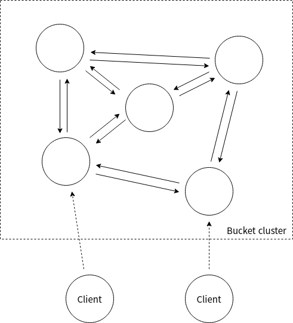
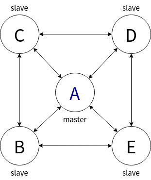

# 🪣 Introduction

Bucket is a lightweight key-value storage.

It also offers clustering features like auto-failover and master-slave replication.

 
  
# 🪣 Network topology

Each node establishes tcp connection with all other nodes in the cluster.

More precisely, a node has two connections per each other node in the cluster: inbound and outbound.

Client can connect to any node in the cluster to interact with it.

When a requested node cannot deal with the message sent by the client,

it responses with  a REDIRECT message that indicates a node capable of it.

(e.g. WRITE request to slave node REDIRECTS to master node)

 

# 🪣 Data replication

Bucket supports master-slave data replication.

A cluster can have a single master node, and multiple slave nodes.

A single master node can accept read/write request and propagtes writes to every other slave nodes in the cluster. Slave nodes are read-only.

In more detail, to propagate writes in correct order, a node must log incomming writes sequentially to special file called *AOF(Append Only File)*.

 When a slave node requests for a replication, a master node reads and sends AOF up to the offset at the time the request was received.

It also buffers incomming write after that offset in memory.

After *AOF*  transfer completes, it starts sending buffered writes to slave node.

To prevent full-copy of dataset in case of master failure, a node holds two kinds of ids: *current-master-id* and *last-master-id.*

When a new master node starts, it creates a new id and initializes *current-master-id* with it. The old *current-master-id* becomes *last-master-id.*

When a slave node finds a new master, its *current-master-id* is set to *current-master-id* of its master.  

Again, old *current-master-id* becomes *last-master-id.*

Finally, when a master node receives replication request from a slave node, 

it checks if *last-master-id* of the slave node is identical to *current-master-id* or *last-master-id* of its own.

If it is, a partial re-synchronization happens. Otherwise, a full re-synchronization is inevitable.

 

# 🪣 Auto failover

Bucket uses [Raft consensus algorithm](https://en.wikipedia.org/wiki/Raft_(algorithm)) to elect a master node. 

When a master node fails, any node in a cluster can start a new election.

A node voted by majority of cluster wins the election, and becomes a new master.

So, as long as the majority of nodes are alive, a cluster can tolerate some failure of its members.

